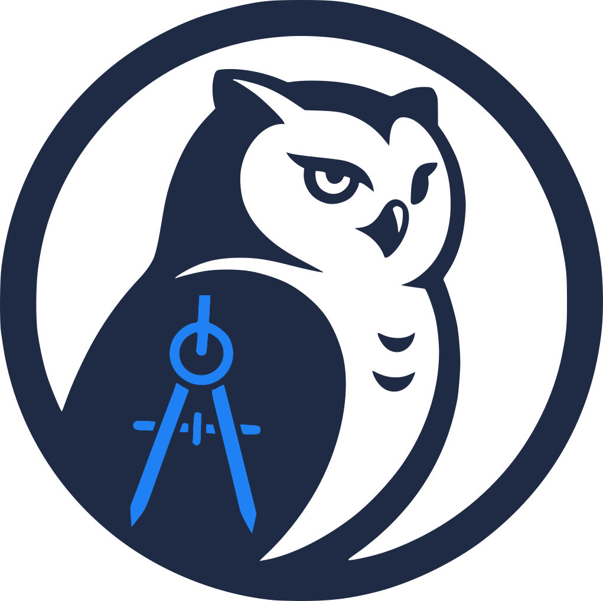
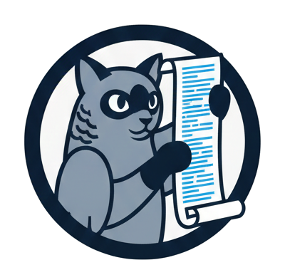

# CueMarshal – AI-Powered DevOps for Software Teams

**From issue to reviewed PR without leaving Git.**

CueMarshal is self-hosted AI DevOps: **GitHub Actions + an AI engineering orchestra** on your own infrastructure. Open an issue, and CueMarshal plans, builds, reviews, tests, and documents the change through Git-native branches and pull requests. You keep final control: review every PR, request edits, and merge when ready.

- **Marshal (Conductor)** — routes work and keeps execution moving
- **Ava (Architect)** — designs the solution and opens a spec PR
- **Dave (Developer)** — writes the implementation on a feature branch
- **Reese (Reviewer)** — checks for bugs, risks, and code quality issues
- **Tess (Tester)** — runs test suites and validates behavior
- **Devin (DevOps)** — handles infrastructure and deployment tasks
- **Dot (Docs)** — keeps documentation clear and current
- **Linton (Linter)** — enforces code quality checks before merge

Every step lives in Gitea as issues, branches, pull requests, and labels. Full audit trail. Full human control.

> ⚠️ **Early stage.** Core workflow is functional. Self-improvement engine works but needs more testing. Mobile app and Kubernetes Helm charts are in progress.

---

## Why CueMarshal?

| Traditional CI/CD | CueMarshal |
|---|---|
| Separate tools for tasks, reviews, docs | Everything lives in Git |
| Fixed pipelines, hard to customize | Flexible agents you configure |
| "Why did it fail?" is unclear | Full reasoning trail in PRs |
| Expensive cloud bills | Run on your hardware, pay only for model calls |
| Vendor lock-in | Open source, fully self-hosted |

**Use Cases:**
- **Ship faster** — Cut code review time from hours to minutes
- **Better quality** — AI reviewers catch security issues humans miss
- **Data sovereignty** — Your code never leaves your servers
- **Cost control** — ~$0.50/issue in API costs vs $100+/month in cloud CI

[Quick Start](#quick-start) · [Architecture](docs/architecture/overview.md) · [Agents](docs/features/agents/overview.md) · [Documentation](#documentation)

---

## Meet the Orchestra

Each team member has a distinct avatar and working style, so activity feels like a real engineering squad instead of a black box.

| Avatar | Member | Role | Personality |
|---|---|---|---|
|  | **Marshal** | Conductor | Starts the symphony and coordinates handoffs |
|  | **Ava** | Architect | Wise visionary planner |
|  | **Dave** | Developer | Industrious builder |
|  | **Reese** | Reviewer | Laser-sharp critic |
|  | **Tess** | Tester | Clever bug washer |
|  | **Devin** | DevOps | Master multi-tasker |
|  | **Dot** | Docs | Explains it clearly |
|  | **Linton** | Linter | Picky perfectionist |

---

## Quick Start

```bash
# Clone the repository
git clone https://github.com/cuemarshal/cuemarshal.git
cd cuemarshal

# One-command setup (handles secrets, deps, and health checks)
./quick-start.sh
```

Open **http://localhost:3300** — Gitea is ready.

> Need full control? See the [detailed setup guide](docs/operations/deployment.md).

### Prerequisites

- Docker and Docker Compose v2+
- 8 GB RAM minimum (16 GB recommended)
- Local Ollama at `http://localhost:11434` running `gemma4:26b`, or at least one cloud LLM API key:
  - [Groq](https://console.groq.com) (free, fast — primary)
  - [Google Gemini](https://aistudio.google.com) (free — fallback)
  - [Azure AI](https://azure.microsoft.com/en-us/products/ai-services) (paid — second fallback)

---

## What's Implemented

- ✅ Conductor orchestrator (task decomposition + agent routing)
- ✅ 7 specialized AI agents (architect, developer, reviewer, tester, devops, docs, linter)
- ✅ Git Flow execution (issue → branch → PR → review → merge)
- ✅ LiteLLM gateway with 3-provider fallback (Groq → Gemini → Azure)
- ✅ MCP servers for tool access (Gitea, Conductor, System)
- ✅ Self-improvement loop (system scans and improves its own codebase)
- ✅ Docker Compose deployment (11 services, one command)
- ⏳ Mobile app (React Native, in progress)
- ⏳ Kubernetes Helm charts (in progress)
- ⏳ Multi-repo support (planned)

---

## How It Works

```
User creates issue in Gitea
         │
    Conductor receives webhook
         │
    Conductor decomposes task → assigns to agents
         │
    ┌────┴──────────────────────────────────┐
    │  Architect  →  spec PR                │
    │  Developer  →  implementation PR      │
    │  Reviewer   →  review comments + fix  │
    │  Tester     →  test results           │
    │  DevOps     →  infra/deployment PR    │
    │  Docs       →  documentation PR       │
    │  Linter     →  pre-merge quality gate │
    └────────────────────────────────────────┘
         │
    Human reviews + merges
         │
    Done. Full audit trail in Git.
```

### Architecture

```
User (Mobile App / Gitea UI)
         │
    Conductor (TypeScript) ── Redis/BullMQ
         │          │
    MCP Servers    LLM Gateway (LiteLLM)
    ├── Gitea MCP      ├── Groq
    ├── Conductor MCP  ├── Google Gemini
    └── System MCP     └── Azure AI
         │
    Gitea Server ── PostgreSQL
         │
    Runners (Gitea Act Runner + OpenCode)
    ├── Developer Agent
    ├── Reviewer Agent
    ├── Tester Agent
    ├── Architect Agent
    ├── DevOps Agent
    ├── Docs Agent
    └── Linter Agent
```

See [Architecture Overview](docs/architecture/overview.md) for full diagrams and data flows.

---

## Services

| Service | Port | Description |
|---------|------|-------------|
| Gitea | 3300 | Git server, issues, PRs, workflows, webhooks |
| Conductor | 4000 (internal) | Orchestrator, webhook handler, mobile API |
| LLM Gateway | 4100 (internal) | LiteLLM proxy with 3-provider fallback |
| Gitea MCP | 4200 (internal) | MCP server for Gitea operations |
| Conductor MCP | 4201 (internal) | MCP server for task/agent coordination |
| System MCP | 4202 (internal) | MCP server for costs, runners, health |
| PostgreSQL | 5432 (internal) | Shared database |
| Redis | 6379 (internal) | Task queue (BullMQ) and cache |
| Nginx | 8180 | Reverse proxy |

---

## Who Should Use CueMarshal?

- **Software teams** wanting AI-assisted code review and task automation
- **Engineering leaders** concerned about vendor lock-in or cloud costs
- **Organizations** with data residency requirements (your code stays on your servers)
- **Developers** already using Gitea who want AI-powered workflows
- **Builders** who want to experiment with AI agent orchestration

---

## Technology Stack

| Layer | Technology |
|-------|-----------|
| Orchestration | TypeScript, Node.js, Express, BullMQ, Drizzle ORM |
| LLM Gateway | LiteLLM (Python), custom callbacks |
| MCP Servers | TypeScript, @modelcontextprotocol/sdk |
| AI Engine | OpenCode (Go), headless/CLI mode |
| Git Platform | Gitea, Gitea Act Runner |
| Mobile | React Native, Expo, TypeScript |
| Database | PostgreSQL |
| Cache/Queue | Redis |
| Proxy | Nginx |
| Containers | Docker, Docker Compose |

---

## Documentation

| Document | Description |
|----------|-------------|
| [Architecture](docs/architecture/overview.md) | System architecture, data flows, component diagrams |
| [Conductor](docs/features/conductor/overview.md) | Conductor service specification |
| [LLM Gateway](docs/features/gateway/overview.md) | LiteLLM configuration, tiered models, fallback |
| [MCP Servers](docs/features/mcp-servers/overview.md) | MCP server specs, tool schemas, dual transport |
| [Agents](docs/features/agents/overview.md) | Agent profiles, system prompts, tool permissions |
| [Workflows](docs/features/workflows/overview.md) | Gitea Actions workflow templates |
| [Runner](docs/features/runner/overview.md) | Custom runner Dockerfile and setup |
| [Mobile App](docs/features/mobile/overview.md) | React Native Expo app specification |
| [Self-Improvement](docs/operations/self-improvement.md) | Self-improvement engine |
| [Model Selection](docs/architecture/model-selection.md) | Automated model selection algorithm |
| [Security](docs/operations/security.md) | Security model and access control |
| [Deployment](docs/operations/deployment.md) | Deployment and infrastructure guide |
| [API Reference](docs/api/api-reference.md) | Conductor REST and WebSocket API |

---

## Contributing

CueMarshal uses its own platform to manage contributions — improvements flow through Gitea issues and PRs, often executed by the AI agents themselves.

To contribute:

1. **Fork** the repository and create a feature branch from `main`
2. **Open an issue** describing what you plan to change before submitting a PR
3. **Follow Git Flow**: one logical change per branch, one PR per issue
4. **Run tests** before opening a PR:
   ```bash
   cd services/mcp-servers && npm test
   cd services/conductor && npm test
   ```
5. **Ensure Docker Compose starts cleanly** with `./quick-start.sh`

PRs are reviewed by the CueMarshal reviewer agent. Humans have final merge authority.

---

## License

MIT — see [LICENSE](LICENSE) for details.
