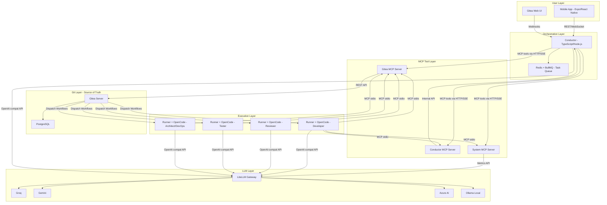
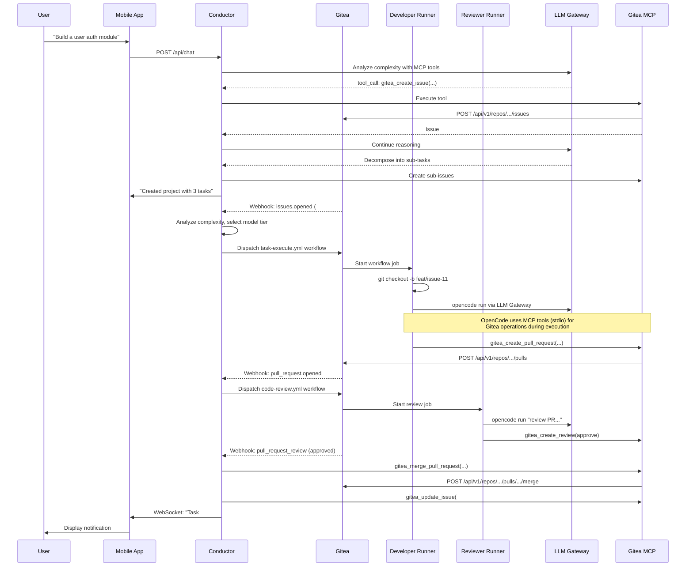

# Architecture

## Overview

CueMarshal is a self-hosted, Git-centric AI software development platform organized into five layers. Each layer has a clear responsibility, and communication between layers follows well-defined interfaces.

```
+-----------------------------------------------------------+
|                     User Layer                            |
|   Mobile App (Expo/React Native)  |  Gitea Web UI        |
+-----------------------------------------------------------+
                        |
+-----------------------------------------------------------+
|                 Orchestration Layer                        |
|   Conductor (TypeScript)  |  Redis + BullMQ               |
+-----------------------------------------------------------+
                        |
+-----------------------------------------------------------+
|                   MCP Tool Layer                          |
|   Gitea MCP  |  Conductor MCP  |  System MCP             |
+-----------------------------------------------------------+
                        |
+-----------------------------------------------------------+
|            Git Layer (Source of Truth)                     |
|   Gitea Server  |  PostgreSQL                             |
+-----------------------------------------------------------+
                        |
+-----------------------------------------------------------+
|                  Execution Layer                           |
|   Runner 1..N (Gitea Act Runner + OpenCode + MCP)         |
+-----------------------------------------------------------+
                        |
+-----------------------------------------------------------+
|                    LLM Layer                               |
|   LiteLLM Gateway  →  Groq / Gemini / Azure AI / Ollama  |
+-----------------------------------------------------------+
```

## Component Diagram



## Layer Descriptions

### User Layer

The entry points for human interaction with the system.

- **Mobile App**: React Native Expo application with a natural language chat interface. Users create projects, assign tasks, and query status through conversation. The app connects to the Conductor via REST and WebSocket.
- **Gitea Web UI**: Standard Gitea web interface for direct repository, issue, and PR management. Webhooks propagate all changes to the Conductor.

### Orchestration Layer

The brain of the system. Receives events, makes decisions, dispatches work.

- **Conductor**: TypeScript/Node.js service that handles webhook events, decomposes tasks, routes to agents, selects models, manages the chat handler, and triggers workflows. See [../features/conductor/overview.md](../features/conductor/overview.md).
- **Redis + BullMQ**: Persistent job queue for async task processing. Ensures reliable delivery of webhook events, workflow triggers, and scheduled jobs. Also serves as WebSocket pub/sub backbone.

### MCP Tool Layer

The universal tool interface that bridges human and agent interactions with the system. All three servers are TypeScript, built with `@modelcontextprotocol/sdk`, and support dual transports.

- **Gitea MCP Server** (port 4200): Structured tools for all Gitea operations (issues, PRs, branches, files, workflows, search).
- **Conductor MCP Server** (port 4201): Tools for task coordination, progress reporting, agent status, and project queries.
- **System MCP Server** (port 4202): Tools for LLM cost tracking, runner utilization, and system health.

Dual transport:
- **HTTP/SSE**: Long-running Docker services used by the Conductor's chat handler. The Conductor registers MCP tools with LLM calls so the model can invoke them.
- **stdio**: Spawned as child processes by OpenCode inside runners. OpenCode's native MCP support manages the lifecycle.

See [../features/mcp-servers/overview.md](../features/mcp-servers/overview.md) for full specifications.

### Git Layer (Source of Truth)

All persistent state lives here.

- **Gitea Server**: Hosts all repositories, issues, pull requests, labels, milestones, webhooks, and workflow definitions. Every task is a Gitea issue. Every code change is a PR. Every status update is a label or comment.
- **PostgreSQL**: Shared database for Gitea data and Conductor state (task tracking, session history, cost accounting).

### Execution Layer

Where AI agents do the actual work.

- **Gitea Act Runners**: Custom Docker images based on the Gitea Act Runner with OpenCode CLI and MCP server binaries pre-installed. Each runner is registered with Gitea and picks up workflow jobs. Runners are stateless; all context comes from the Git repository and Gitea issues.
- **OpenCode**: AI coding agent running in headless mode (`opencode run "prompt"`). Configured with role-specific agent profiles, MCP servers, and LLM Gateway endpoint.

See [../features/runner/overview.md](../features/runner/overview.md) and [../features/agents/overview.md](../features/agents/overview.md).

### LLM Layer

Intelligent model routing and provider management.

- **LiteLLM Gateway** (port 4100): OpenAI-compatible API proxy. Routes requests to the optimal provider based on model tier. Handles fallback on rate limits, retries, and cost tracking.
- **Upstream Providers**: Groq, Gemini, Azure AI, and optional local models via Ollama.

See [../features/gateway/overview.md](../features/gateway/overview.md) and [model-selection.md](model-selection.md).

## Data Flow: Task Lifecycle

The complete lifecycle of a task from creation to completion:



## Network Topology

All services communicate over an internal Docker network. Only Nginx is exposed externally.

```
Internet
    |
    v
[Nginx :80/:443]
    |
    +---> [Gitea :3000]       ──> [PostgreSQL :5432]
    +---> [Conductor :4000]   ──> [Redis :6379]
    +---> [Gateway :4100]     ──> [Ollama :11434]
    |
    (internal only)
    +---> [MCP-Gitea :4200]
    +---> [MCP-Conductor :4201]
    +---> [MCP-System :4202]
    +---> [Runner-1..N]
```

## Key Design Decisions

1. **MCP as universal tool layer**: Rather than having agents use raw HTTP/curl calls, all interactions with Gitea, the Conductor, and system metrics go through MCP servers. This provides typed schemas, validation, permission scoping, and a single abstraction for both human chat and automated agents.

2. **Dual MCP transport**: The same MCP server code runs in two modes — stdio for runners (spawned by OpenCode) and HTTP/SSE for the Conductor (persistent network connections). This avoids duplicating tool logic.

3. **LiteLLM over custom gateway**: LiteLLM provides proven provider routing, fallback, and cost tracking out of the box. Custom logic is layered on top via callbacks and the Conductor's model selector, rather than reimplementing these capabilities.

4. **Stateless runners**: Runners carry no persistent state. All context is reconstructed from the Git repository and Gitea issue data at the start of each workflow job. This enables horizontal scaling and failure recovery.

5. **Webhook-driven orchestration**: The Conductor reacts to Gitea webhook events rather than polling. This provides real-time responsiveness and clear event-driven architecture.

6. **Task decomposition via LLM**: Complex tasks are broken down into sub-tasks by the LLM itself, using the model selector to choose an appropriate tier. The decomposition output maps directly to Gitea issues with role labels.
