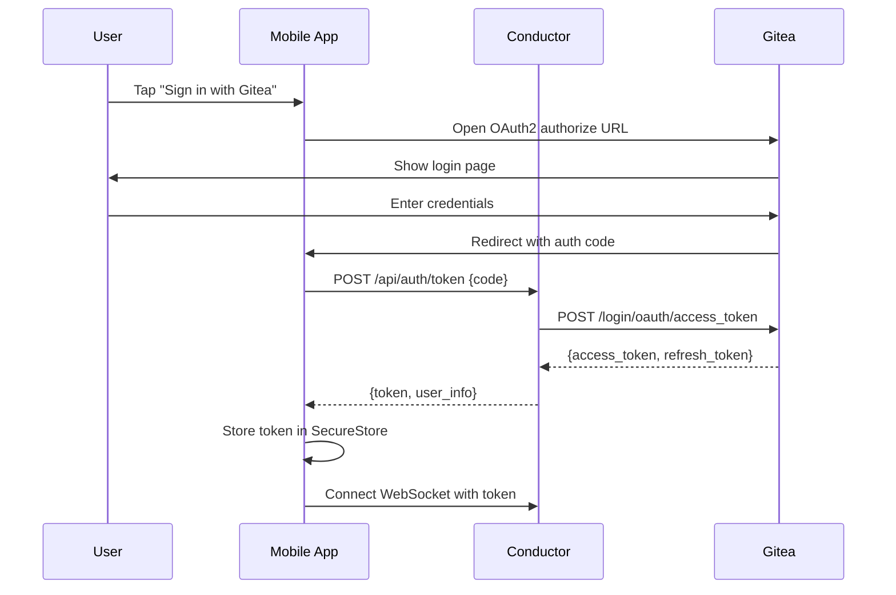

# Mobile Application

## Overview

The CueMarshal mobile app is a React Native Expo application that provides a natural language chat interface for interacting with the platform. Users can query status and monitor system health through conversation. The app connects to the Conductor service via REST APIs.

## Technology Stack

- **Framework**: React Native with Expo (SDK 52+)
- **Language**: TypeScript
- **Navigation**: Expo Router (file-based routing)
- **State Management**: Zustand
- **Networking**: fetch (REST), Axios (OAuth token exchange)
- **Authentication**: Gitea OAuth2 via Expo AuthSession
- **UI Components**: React Native Paper (Material Design 3)
- **Push Notifications**: Not implemented yet

## Directory Structure

```
mobile/
├── package.json
├── app.json                    # Expo configuration
├── tsconfig.json
├── app/
│   ├── _layout.tsx             # Root layout with auth guard
│   ├── auth/
│   │   ├── _layout.tsx         # Auth layout
│   │   └── login.tsx           # Gitea OAuth2 login screen
│   ├── oauth.tsx               # OAuth callback route
│   ├── tabs/
│   │   ├── _layout.tsx         # Tab navigation layout
│   │   ├── chat.tsx            # Natural language chat interface
│   │   ├── dashboard.tsx       # System metrics and status
│   │   └── profile.tsx         # User/profile settings
│   └── components/
│       ├── ChatBubble.tsx      # Chat message bubble
│       ├── ChatInput.tsx       # Message input with send button
│       ├── CostBadge.tsx       # LLM cost display
│       └── StatusIndicator.tsx # Service health indicator
├── services/
│   ├── api.ts                  # Conductor REST API client
│   ├── auth.ts                 # Gitea OAuth2 authentication
│   └── storage.ts              # Secure token storage
├── stores/
│   ├── auth.ts                 # Auth state (Zustand)
│   └── chat.ts                 # Chat session state
└── types/
  ├── auth.ts                 # Auth types
  └── chat.ts                 # Chat message types
```

## Screens

### Login Screen (`(auth)/login.tsx`)

Gitea OAuth2 authentication flow.

**Flow:**
1. User taps "Sign in with Gitea"
2. Expo AuthSession opens Gitea OAuth2 authorization URL
3. User authenticates in Gitea
4. Redirect back to app with authorization code
5. App exchanges code for access token via Conductor
6. Token stored securely via Expo SecureStore

**OAuth2 Configuration:**
- Authorization URL: `{GITEA_URL}/login/oauth/authorize`
- Token URL: `{GITEA_URL}/login/oauth/access_token`
- Scopes: `read:user`, `read:organization`, `read:repository`, `write:repository`, `read:issue`, `write:issue`
- Client ID/Secret: Registered as OAuth2 application in Gitea

### Chat Screen (`(tabs)/chat.tsx`)

The primary interface. A conversational chat UI where users interact with the platform in natural language.

**Features:**
- Message input with send button
- Chat bubble display (user messages, assistant responses)
- Typing indicator while waiting for response
- Tool call visualization (shows when the assistant is querying Gitea, checking status, etc.)
- Session history (scroll up to see previous messages)
- New session button
- Streamed responses (progressive display as LLM generates text)

**Example Conversations:**

```
User: "Create a new project for a REST API with user authentication"
Assistant: I've created the project. Here's what I set up:
  - Repository: cuemarshal/rest-api-auth
  - Issue #1: Design authentication architecture (assigned to architect)
  - Issue #2: Implement user registration endpoint (assigned to developer)
  - Issue #3: Implement login/JWT token flow (assigned to developer)
  - Issue #4: Write authentication tests (assigned to tester)
  - Issue #5: Create API documentation (assigned to docs)
  The architect agent will start working on the design shortly.

User: "What's the status of the e-commerce project?"
Assistant: Here's the current status of the e-commerce project:
  - 12 tasks total: 8 completed, 2 in progress, 2 pending
  - Active: Developer working on payment integration (#34)
  - Active: Tester writing tests for cart module (#31)
  - Next up: API documentation (#35), deployment config (#36)
  - LLM cost so far: $12.50 this month
  - All 4 runners are healthy.

User: "Show me the PR for the login feature"
Assistant: PR #7: feat(#3): Implement JWT login flow
  - Status: Awaiting review
  - Changed files: 5 (+320, -12)
  - Branch: feat/issue-3 → main
  - Created by: developer agent, 2 hours ago
  Would you like me to assign a reviewer?
```

**API Integration:**

Chat messages are sent to `POST /api/chat` on the Conductor. The Conductor processes them using the MCP-powered chat handler (see [../conductor/overview.md](../conductor/overview.md) and [../mcp-servers/overview.md](../mcp-servers/overview.md)).

```typescript
// Request
POST /api/chat
{
  "session_id": "uuid-optional",
  "message": "Create a new project for a REST API"
}

// Response
{
  "sessionId": "uuid",
  "message": {
    "role": "assistant",
    "content": "I've created the project...",
    "toolCallsSummary": [
      { "tool": "gitea_create_repo", "result_summary": "Created cuemarshal/rest-api-auth" },
      { "tool": "gitea_create_issue", "result_summary": "Created issue #1" },
      { "tool": "gitea_create_issue", "result_summary": "Created issue #2" }
    ]
  }
}
```

### Dashboard Screen (`tabs/dashboard.tsx`)

System metrics and health overview.

**Sections:**

1. **Service Health**: Green/red indicators for Gitea, Conductor, Gateway, Redis
2. **Runner Status**: Active/idle/total runners, queue depth
3. **LLM Costs**: Monthly spend, breakdown by tier, budget remaining
4. **Activity Feed**: Recent events (PRs merged, issues created, reviews completed)
5. **Agent Performance**: Tasks completed, success rate, avg. duration per role

**API:** `GET /api/dashboard` on the Conductor (aggregates data from MCP tools).

### Profile Screen (`tabs/profile.tsx`)

User profile and settings.

**Features:**
- Displays user info from stored OAuth token
- Sign out action
- Server URL configuration (base URL for Gitea/Conductor)
- UI-only toggles for notifications and dark mode (not wired)

## Real-Time Updates

Real-time WebSocket updates are not implemented yet. The dashboard and chat screens use REST polling on demand.
  private reconnectAttempts = 0;
  private maxReconnectAttempts = 10;

  connect(url: string, token: string) {
    this.ws = new WebSocket(`${url}?token=${token}`);

    this.ws.onmessage = (event) => {
      const data = JSON.parse(event.data);
      switch (data.type) {
        case "task:progress":
          useProjectStore.getState().updateTaskProgress(data.payload);
          break;
        case "task:completed":
          useNotificationStore.getState().addNotification({
            title: "Task Completed",
            body: `Task completed, PR #${data.payload.pr_number} created`,
          });
          break;
        // ... other event handlers
      }
    };

    this.ws.onclose = () => {
      if (this.reconnectAttempts < this.maxReconnectAttempts) {
        setTimeout(() => {
          this.reconnectAttempts++;
          this.connect(url, token);
        }, Math.min(1000 * Math.pow(2, this.reconnectAttempts), 30000));
      }
    };
  }

  disconnect() {
    this.ws?.close();
    this.ws = null;
  }
}
```

## Push Notifications

For important events when the app is in the background:

- Task completed (PR created)
- PR review completed
- Workflow failed
- Self-improvement completed
- Budget threshold reached (80%, 90%, 100%)

Implemented using Expo Notifications with the Conductor sending push tokens.

## Authentication Flow



## Configuration

### app.json

```json
{
  "expo": {
    "name": "CueMarshal",
    "slug": "cuemarshal",
    "version": "1.0.0",
    "scheme": "cuemarshal",
    "platforms": ["ios", "android"],
    "plugins": [
      "expo-router",
      "expo-secure-store",
      [
        "expo-notifications",
        {
          "icon": "./assets/notification-icon.png"
        }
      ]
    ],
    "extra": {
      "conductorUrl": "https://cuemarshal.example.com/api",
      "giteaUrl": "https://gitea.example.com",
      "oauthClientId": "your-oauth-client-id"
    }
  }
}
```

## Building and Deployment

```bash
# Development
cd mobile
npm install
npx expo start

# Build for iOS
npx eas build --platform ios

# Build for Android
npx eas build --platform android

# Over-the-air update
npx eas update --branch production
```
