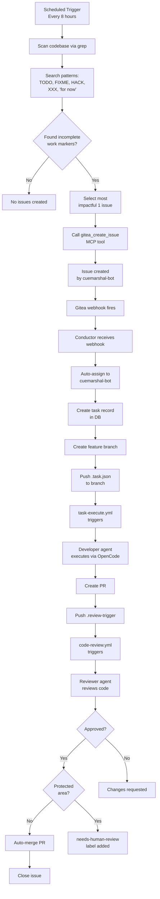

# Self-Improvement System

## Overview

The self-improvement system enables the CueMarshal platform to continuously improve its own codebase by autonomously scanning for incomplete work, creating Gitea issues, and executing improvements through the standard Git Flow pipeline — the same process used for regular tasks.

## Design Principles

1. **Safety first**: All self-improvements go through the same review process as regular work.
2. **Budget-aware**: Optimized to operate within free-tier LLM limits (Groq, Gemini).
3. **Self-healing**: Recovery service automatically detects and re-triggers orphaned issues.
4. **Protected areas**: Core infrastructure (Conductor, Gateway, MCP servers) requires human approval before merging.
5. **Incremental**: Creates 1 issue per run to minimize token usage and avoid rate limits.
6. **Rate-limit resilient**: 3-provider fallback chain with priority-based routing.

## Architecture



## Trigger Conditions

The self-improvement system is triggered in two ways:

### 1. Scheduled (Cron) - Fallback Method

The `self-improve.yml` workflow runs every 8 hours as a fallback:

```yaml
on:
  schedule:
    - cron: "0 */8 * * *"  # Every 8 hours (3 runs/day)
  workflow_dispatch:
    inputs:
      correlation_id:
        description: 'Correlation ID for tracing'
        required: false
        default: ''
```

**Frequency rationale**: 8-hour intervals reduce daily runs from 48 to 3, saving ~95% of tokens and staying within free-tier limits (Groq 500K TPD, Gemini daily quota).

### 2. Manual Trigger

Use the Gitea workflow dispatch API (Gitea 1.25+):

```bash
curl -X POST \
  -H "Authorization: token $GITEA_TOKEN" \
  -H "Content-Type: application/json" \
  "$GITEA_URL/api/v1/repos/cuemarshal/cuemarshal/actions/workflows/self-improve.yml/dispatches" \
  -d '{"ref": "main", "inputs": {"correlation_id": "manual-trigger"}}'
```

This immediately triggers a self-improvement scan regardless of schedule — no commits on `main`.

### 3. Idle-Check Workflow - Primary Method

A lightweight workflow (`idle-check.yml`) runs every 30 minutes and calls the Conductor internal API to check readiness (idle runners, budget, cooldown). If ready, Conductor triggers the self-improve workflow via the `workflow_dispatch` API — zero commits on `main`.

## Workflow Dispatch Trigger

### Overview

The self-improvement system uses **Gitea's native `workflow_dispatch` API** to trigger the workflow. This avoids polluting the `main` branch with sentinel file commits.

**Workflow**: `self-improve.yml` | **API**: `POST /repos/{owner}/{repo}/actions/workflows/self-improve.yml/dispatches`

### Dispatch Input Schema

```json
{
  "ref": "main",
  "inputs": {
    "correlation_id": "<UUID or correlation string>"
  }
}
```

### Cooldown and Safety

- Redis-based cooldown (default 4h via `SELF_IMPROVE_COOLDOWN_HOURS`)
- Distributed lock prevents concurrent triggers
- Idempotent: multiple requests within cooldown are ignored
- Force override: `force: true` bypasses cooldown

### Conductor Internal API

**Endpoints**:

- `POST /api/internal/self-improve/check`
- `POST /api/internal/self-improve/trigger`

**Auth**: Bearer token (`CONDUCTOR_SECRET`)

**Trigger request**: `{"owner": "cuemarshal", "repo": "cuemarshal", "source": "idle-check", "reason": "idle runners detected"}`

**Trigger response**: `{"success": true|false, "reason": "..."}`

### Auto-Recovery (Self-Healing)

The Conductor runs a recovery service every hour that:

1. Scans all open issues assigned to `cuemarshal-bot`
2. Checks if each has a task record in the database
3. Re-triggers workflows for any orphaned issues
4. Retries failed tasks

This ensures issues created during system failures or database migrations are automatically recovered and processed.

## Scanning Categories

### 1. Deterministic Scanners (Currently Implemented)

Self-improvement uses deterministic scanners to produce structured findings. The workflow runs:

```bash
bash scripts/scanners/run-all-scanners.sh
```

This generates `improvement-findings.json`, which the LLM prioritizes and converts into Gitea issues.

**Current scanners** (see [scripts/scanners/README.md](../../scripts/scanners/README.md)):

- TODO markers (`FIXME`, `HACK`, `BUG`, `XXX`, `TODO`, `WORKAROUND`, `DEPRECATED`, `OPTIMIZE`)
- Dependency updates
- Test coverage gaps
- Stale/missing documentation

**Prioritization**: The LLM ranks findings by severity and `priority_score` before creating issues.

## Priority Scoring

**Current implementation**: The LLM (gpt-4o-mini via Groq/Gemini/Azure AI fallback) selects the "most impactful" improvement from grep results based on its understanding of:

- Code location (core services vs. utilities)
- Comment severity (FIXME > TODO)
- Impact on functionality (auth, data integrity > logs, comments)

**Future**: Implement quantitative scoring algorithm:

```
Score = (impact * 0.35) + (frequency * 0.25) + (ease * 0.25) + (safety * 0.15)
```

## Rate Limit Management (Optimized for Free Tiers)

### Current Configuration

| Setting | Value | Rationale |
|---------|-------|-----------|
| Schedule | `0 */8 * * *` (every 8 hours) | 3 runs/day instead of 48 = 95% token reduction |
| Issues per run | 1 | 3 LLM calls instead of 4 = 25% token reduction per run |
| Cache TTL | 3600s (1 hour) | Reduces redundant provider calls |
| Total daily tokens | ~135K | Well under Groq 500K daily limit |

### Provider Fallback Chain

1. **Groq** (`llama-4-scout`, order:1) - 30K TPM, 500K TPD
2. **Gemini** (`gemini-2.0-flash`, order:2) - Free tier  
3. **Azure AI** (order:3):
   - Simple tiers: `kimi-k2.5` (20K limit)
   - Complex tiers: `gpt-5.2-chat` (50K limit)

**Token usage per run**: ~45K (grep scan + analysis + issue creation + wrap-up)

**Resilience**: If Groq hits TPM limit, falls back to Gemini. If Gemini quota exhausted, falls back to Azure AI.

### Cost Tracking (Planned)

Future implementation will track self-improvement costs separately via `cost_records` table with `project='self-improvement'` tag.

## Protected Areas

Some parts of the system are too critical for fully automated changes:

| Protected Path | Reason | Required Approval |
|----------------|--------|-------------------|
| `services/conductor/` | Core orchestration logic | Human review |
| `services/gateway/` | LLM routing configuration | Human review |
| `services/mcp-servers/` | Tool definitions and auth | Human review |
| `infrastructure/` | Server and database config | Human review |
| `docker-compose.yml` | Service orchestration | Human review |
| `.env*` | Secrets and configuration | Blocked entirely |

Protected area PRs are labeled with `needs-human-review` and are not auto-merged even if the reviewer agent approves. A notification is sent to the mobile app.

## Issue Format

Self-improvement issues created by the workflow include:

**Title**: Descriptive action-oriented title (e.g., "Implement Database Query for Actual Spend")

**Body**:

- Description of the incomplete work
- File paths and line numbers where changes are needed
- Must include the text `self-improvement` for tracking

**Example** (Issue #10):

```markdown
The current implementation hardcodes costs as 0. This should be replaced 
with an actual database query to get the cost from the cost_records table.

This is a self-improvement task.
```

**Auto-assigned**: Issues are automatically assigned to `cuemarshal-bot` when the Conductor processes them.

**No labels**: Labels are omitted to simplify the MCP tool call and avoid label ID lookup overhead.

## Self-Healing Recovery Service

The Conductor runs a recovery service that ensures no assigned work is lost:

**Schedule**: Every 60 minutes + once on startup (after 30s delay)

**Detection logic**:

```typescript
// For each issue assigned to cuemarshal-bot:
1. Check if task record exists in Conductor DB
2. If NO task record → orphaned issue → re-trigger workflow
3. If task.status === "failed" → retry the task
```

**Validated scenarios**:

- ✓ Issues created before database migration (issues #1-#10)
- ✓ Issues created during Conductor crash
- ✓ Failed tasks due to rate limits or errors

**Logs** (`docker logs cuemarshal-conductor`):

```
{"level":30,"msg":"Orphaned issue detected - re-triggering","issue":10}
{"level":30,"msg":"Orphaned issue re-triggered","issue":10}
```

This makes the self-improvement system truly autonomous and self-healing.

## Current Status

**Validated** (as of 2026-02-22):

- ✓ Workflow runs every 8 hours + manual trigger
- ✓ Grep scans find TODO, FIXME, HACK, XXX, "for now" comments
- ✓ Issues created via `gitea_create_issue` MCP tool
- ✓ Auto-assigned to `cuemarshal-bot` by Conductor
- ✓ Auto-recovery detects and re-triggers orphaned issues
- ✓ Complete Git Flow pipeline (issue → branch → code → PR → review → merge)
- ✓ 3-provider fallback works (Groq → Gemini → Azure AI)
- ✓ Operates within free-tier limits (~135K tokens/day < 500K limit)

**Active issues**: 11 self-improvement issues in progress (validated 2026-02-22)

**Next improvements**:

- Implement categories #2-#6 (test coverage, code quality, dependencies, docs, error logs)
- Add quantitative priority scoring
- Implement cost tracking and budget enforcement
- Add metrics dashboard
